[原作](https://github.com/zhouhaoyi/Informer2020#colablink) [paper](https://arxiv.org/abs/2012.07436)

## ProbSparse Self-attention

O(L * L) ->  O(L * log(L))

原transformer的attention计算为：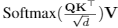

也可以写成：

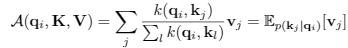

然后定义：

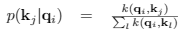

k func表示：

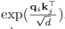

ProbSparse Self-attention的想法是，将不重要的attention计算屏蔽掉。得到一个只含有主要信息的 $\bar{Q}$.

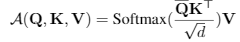

计算 $\bar{Q}$ 如下：

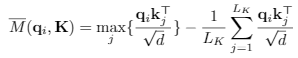

取 $\bar{M}$ 的top u个query向量，求得  $\bar{Q}$ 。

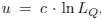

其想法是通过 KL 距离计算attention分布与均匀分布的差异，取其重要的部分。然后为了计算效率，取$M$的上界，提高计算效率。

从：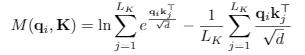

变为：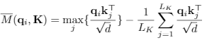

## The architecture 

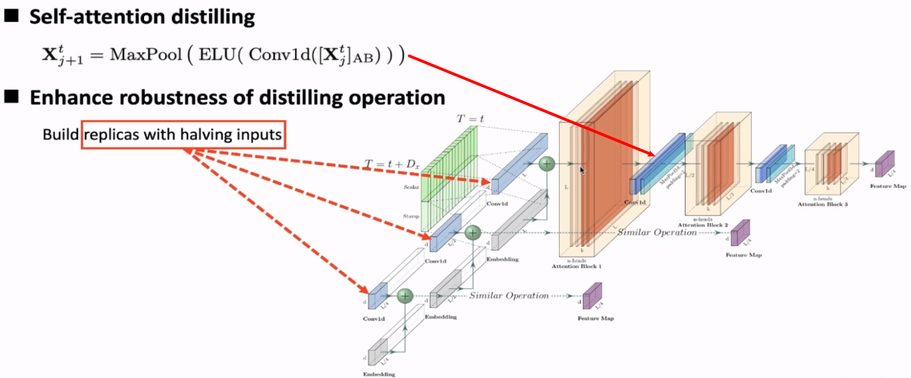

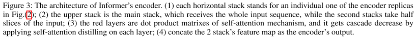

- 不同维度的输入
- 逐渐被distill的hidden representation

decoder直接使用transformer在encoder中的计算方法，不进行动态解码。直接在输入为 $X_0$的位置，取最后一层输出。

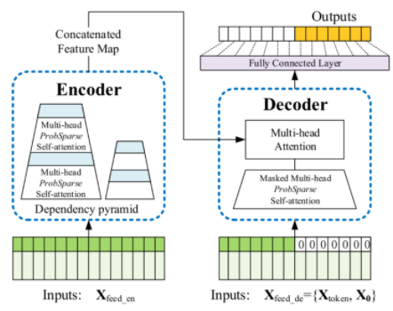

实验验证了ProbSparse Self-attention的有效性。

适合长序列预测任务。

