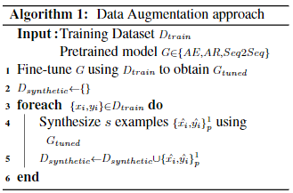

## NOTE

1. 随机修改eda（eda.py），是以句子为单位进行的，使用长文本要分句。

2. eda可能会带来过拟合，选择一定比例进行。训练时，可选择几个epoch使用eda的数据。

3. 随机修改eda，是中文分词后，再进行随机替换。模型输入是以词为单位还是以字为单位，有影响。以字为单位，可以考虑重新分字再进行eda。

4. 随机删除、插入eda，最好选择TF-IDF值相对较低的词。关键词会影响原本的语义。

5. eda要根据实际效果修改，比如文本匹配任务上，单独随机删除就有一定效果，加上其他方法却使效果降低。

6. 不要期望eda带来很大的提升。

7. 中英文互译的eda方法，是一种semantic level的方法。注意处理的文件格式处理，翻译脚本要求是json格式文件。

8. 中英文互译的eda，相对而言也是一种不太稳定的方法，效果比生成式方法会稍好。

9. 其他数据增强方法：

   - 

     Data Augmentation using Pre-trained Transformer Models.   Alexa AI
     
     生成式的数据增强相对而言是更不稳定，更不靠谱的。一般不用。
     
   - UDA：半监督方法，较新的方法。

### Usage

`run_eda`--运行随机修改eda

`back_trans`--运行翻译eda，注意来回互译。`run_trans.sh`为示例

`run_to_json.sh`--将cvs文件转为json，再进行翻译。

## Ref

https://github.com/jasonwei20/eda_nlp

https://github.com/xueyouluo/cn-data-enhance

https://github.com/hujingshuang/MTrans